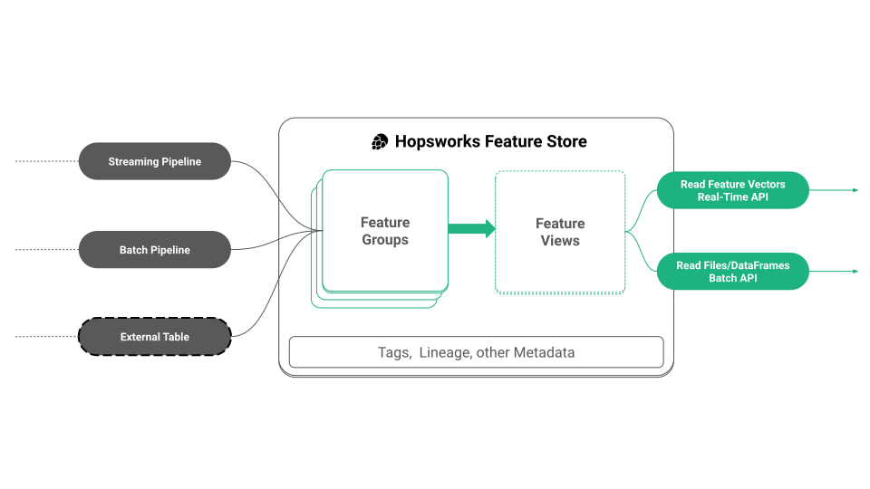
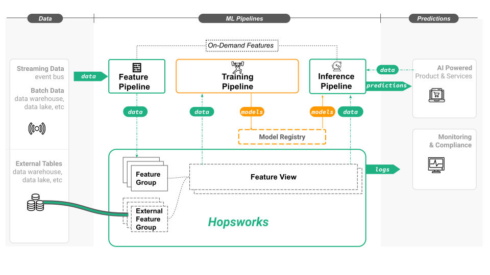

## What is Hopsworks Feature Store?

Hopsworks Feature Store is a data platform that manages features for model training and model inference. The Hopsworks Feature Store provides the HSFS API to enable clients to write features to feature groups in the feature store. In Hopsworks, you read from the feature using a feature view, a selection of features typically used as input to a model for training and inference. The feature view provides both a real-time low latency API to retrieve pre-computed features for operational models as well as a high throughput batch API, used to create training data and to retrieve batch inference data.

##HSFS API

The HSFS (HopsworkS Feature Store) API is how you, as a developer, will use the feature store.
The HSFS API helps simplify some of the problems that feature stores address including:

 - consistent features for training and serving
 - centralized, secure access to features
 - point-in-time JOINs of features to create training data with no data leakage
 - easier connection and backfilling of features from external data sources
 - use of external tables as features
 - transparent computation of statistics and usage data for features.

## Write to feature groups, read from feature views.
You write to feature groups with a feature pipeline program. The program can be written in Python, Spark, Flink, or SQL.

You read from views on top of the feature groups, called feature views. That is, a feature view does not store feature data, but is a logical grouping of features. Typically, you define a feature view because you want to train/deploy a model with exactly those features in the feature view. Feature views enable the reuse of feature data from different feature groups across different models.

##ML Pipelines

ML Systems built on a feature store decompose the problem of transforming input data into models and predictions into 3 different ML pipelines

 - feature pipelines transform raw data into features using aggregations, binning, dimensionality reduction, and so on. The output are features (and labels/targets) that are stored in feature groups.
 - a training pipeline trains a model using a feature view to retrieve a consistent snapshot of split training data. The output is a model that is stored in a model registry.
 - an inference pipeline takes a trained model (from a model registry) and new input features, and calls predict on the model using the input features. The output is predictions that are consumed by an AI-enabled applicationn.

In the above figure, we can see the feature pipeline(s), training pipeline(s), and batch/online inference pipeline(s), and how they read and write to the feature store.