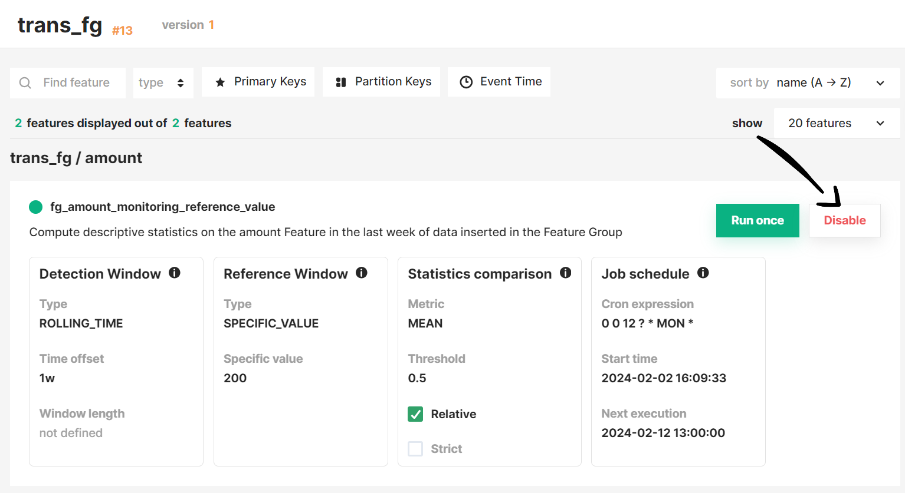

# Advanced guide

An introduction to Feature Monitoring can be found in the guides for [Feature Groups](../feature_group/feature_monitoring.md) and [Feature Views](../feature_view/feature_monitoring.md). In addition, you can get started quickly by running our [tutorial for feature monitoring](https://github.com/logicalclocks/hopsworks-tutorials/blob/master/integrations/feature-monitoring/feature-monitoring.ipynb).

## Retrieve feature monitoring configurations

### From UI

An overview of all feature monitoring configurations is listed in the ^^Feature Monitoring^^ section in the Feature Group and Feature View overview page. 

### From Python client

You can retrieve one or more feature monitoring configurations from the Feature Group and Feature View Python objects and filter them by name, configuration id or feature name. 

=== "Python"

    ```python3
    # retrieve all configurations
    fm_configs = trans_fg.get_feature_monitoring_configs()  # from a feature group
    fm_configs = trans_fv.get_feature_monitoring_configs()  # or a feature view

    # retrieve a configuration by name
    fm_config = trans_fg.get_feature_monitoring_configs(
        name="trans_fg_all_features_monitoring",
    )

    # or by config id
    fm_config = trans_fg.get_feature_monitoring_configs(
        config_id=1,
    )

    # or for a specific feature
    fm_configs = trans_fg.get_feature_monitoring_configs(
        feature_name="amount",
    )
    ```

## Disable feature monitoring

You can enable or disable feature monitoring while keeping the historical statistics and comparison results.

### From UI

In the overview page for feature monitoring, you can enable or disable a specific configuration by clicking on the ^^Disable^^ button.



### From Python client

You can easily enable or disable a specific feature monitoring configuration using the Python object.

=== "Python"

    ```python3
    # disable a specific feature monitoring configuration
    fm_config.disable()

    # disable a specific feature monitoring configuration
    fm_config.enable()
    ```

## Run the statistics comparison manually

You can trigger the feature monitoring job on demand, to compute and compare statistics on the detection and reference windows according to the feature monitoring configuration.

### From UI

In the overview page for feature monitoring, you can trigger the computation and comparison of statistics for a specific configuration by clicking on the ^^Run once^^ button.

!!! note
    Triggering the feature monitoring job manually does **not** affect the underlying schedule.


### From Python client

To trigger the feature monitoring job once from the Python API, use the feature monitoring Python object as shown in the example below.

=== "Python"

    ```python3
    # run the feature monitoring job once
    fm_config.run_job()
    ```

## Get feature monitoring results

### From UI

The easiest way to explore the statistics and comparison results is using the Hopsworks ==interactive graph== for Feature Monitoring. See more information on the [Interactive graph guide](interactive_graph.md).


### From Python client

Alternatively, you can retrieve all the statistics and comparison results using the feature monitoring configuration Python object as shown in the example below.

=== "Python"

    ```python3
    # retrieve all feature monitoring results from a specific config
    fm_results = fm_config.get_history()

    # or filter results by date
    fm_results = fm_config.get_history(
        start_time="2023-01-01",
        end_time="2023-01-31",
    )
    ```

## Delete a feature monitoring configuration

Deleting a feature monitoring configuration also deletes the historical statistics and comparison results attached to this configuration.

### From Python client

You can delete feature monitoring configurations using the Python API only, as shown in the example below.

=== "Python"

    ```python3
    fm_config.delete()
    ```
